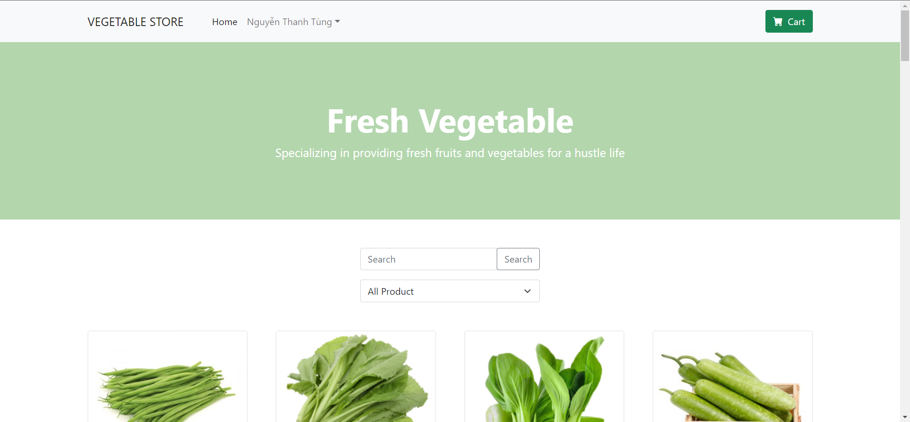
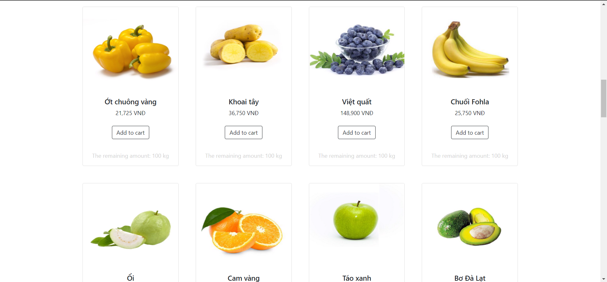
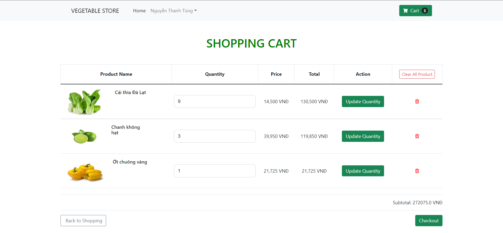
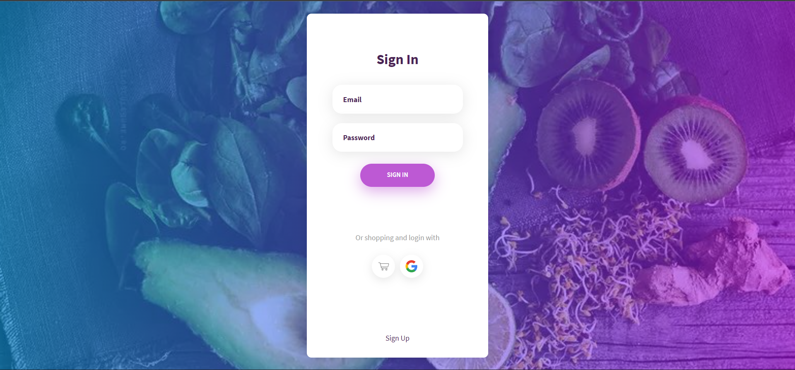
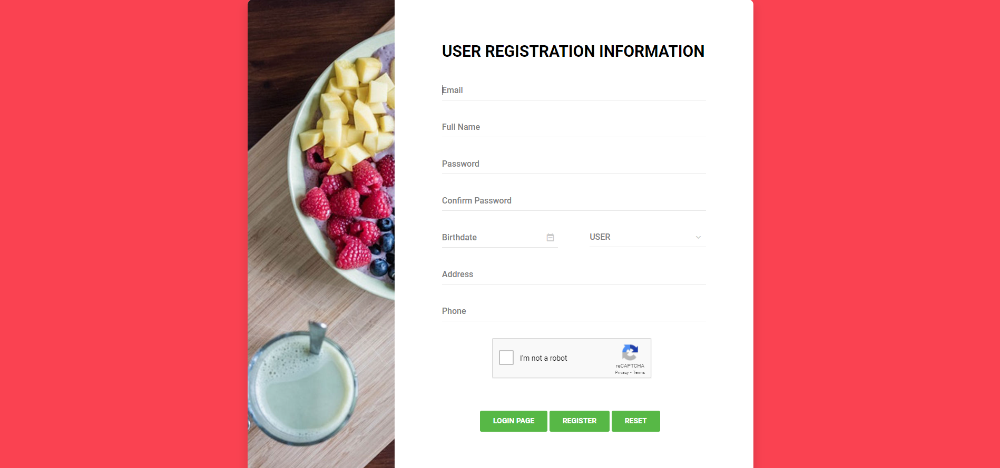
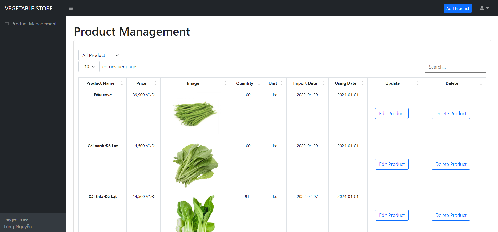
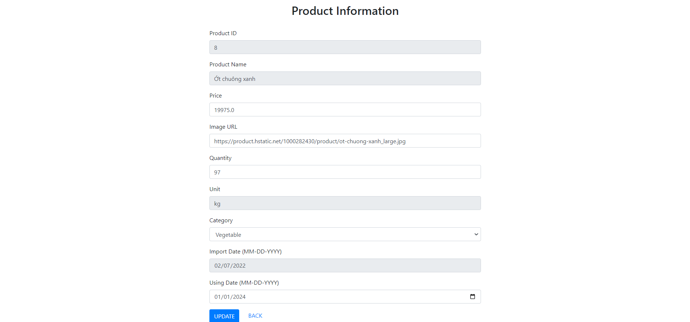
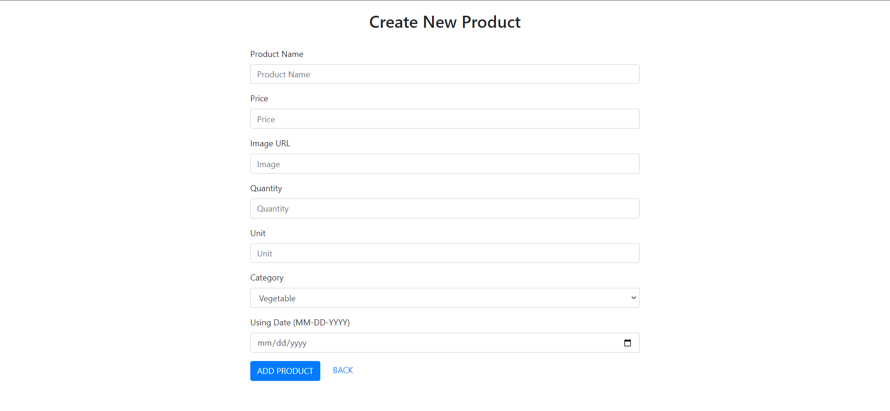

# Vegetable Store (Java Web Application Development Assignment)

## 💡 Introduction

The Vegetable Store specializes in providing fresh and clean vegetables every day, making it easy for customers to buy fresh vegetables in a hustle life. And more especially during this COVID 19 pandemic.

## 👋 Background

Individual Assignment for `Java Web Application Development (PRJ301)` subject at FPT University.

## ⚙️ Technology

- Front End
  - `Bootstrap 5`
  - `JSTL` - Standard Tag Library for JSP
- Backend
  - `Servlet` - Java programming language class that is used to extend the capabilities of servers
  - `JDBC` - A Java API to connect and execute the query with the database
  - `MS SQL` - A relational database management system developed by Microsoft

## 🌿 Preview images

<br>

&nbsp;

&nbsp;

&nbsp;

&nbsp;

&nbsp;

&nbsp;

&nbsp;


<br>

## 🏃‍♂️ How to run project

- To run this project, you should use Netbeans IDE (especially version 12.4) to run easily, another IDE like IntelliJ, Eclipse,... You need to find the way to config this project before using.
- After import project to IDE, please import `JSTL Library` and `external library` from `lib` folder.
- At `src\java\sendemail\SendEmail.java` file, you need to change this code into your email and password to use `Send Email function`.

```java
    String myAccountEmail = "YourEmail";
    String password = "YourEmailPassword";
```

- After that, you click [here](https://myaccount.google.com/security?hl=en), sign in with the gmail account you have entered above `(if you haven't logged in yet)`, scroll down to `Less secure app access` and turn it `ON`
- At `web\META-INF\context.xml` file, you need to config as below:

```java
<Context path="/VegetableStore">
    <Resource name="DBCon" auth="Container" type="javax.sql.DataSource"
              username="YourDBUser(Change it)" password="YourDBPassword(Change it)"
              driverClassName="com.microsoft.sqlserver.jdbc.SQLServerDriver"
              url="jdbc:sqlserver://localhost:1433;databaseName=VegetableStore">
    </Resource>
</Context>
```

- Set up database by running the `script.sql` file in `database` folder.
- Finally, let's try to go shopping 🛒

## ⚠️ Note

- To use `Admin` role with this project, please login with `username: admin@gmail.com; password: 1`
- To use `User` role with this project, please login with `username: user@gmail.com; password: 1` or use `Sign up` to create account.

## License & copyright

© Tung Nguyen | Licensed under the [MIT LICENSE](LICENSE).
